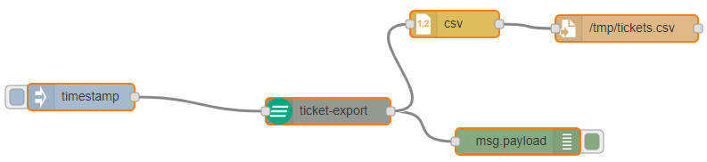

# node-red-contrib-dot4

## Connect your REALTECH Dot4 to a Node-RED server 

[Node-RED][1] contribution package for [REALTECH Dot4][2]

## Install

This assumes you have [Node-RED](https://nodered.org) already installed and working, if you need to install Node-RED see [here](https://nodered.org/docs/getting-started/).

Run the following command in the root directory of your Node-RED install

    npm install node-red-contrib-dot4

Run the following command for global install

    npm install -g node-red-contrib-dot4

try these options on npm install to build, if you have problems to install

    --unsafe-perm --build-from-source
    
## Included Nodes

The installed nodes have more detailed information in the Node-RED info pane shown when the node is selected. Below is a quick summary.

### CI Search - `ci-search`

Search configuration items in REALTECH .4

### KPI Data Export - `saKpiRepository-export`

Export data from the REALTECH .4 Service Assurance KPI Repository which also includes the data of SmaRT Compass.

### KPI Data Import - `saKpiRepository-import`

Import data into the REALTECH .4 Service Assurance KPI Repository which also includes the data of SmaRT Compass.

### KPI Definitions - `saKpiRepository-manageKpi`

Define, read or change a new KPI in the REALTECH .4 Service Assurance KPI Repository which also includes the data of SmaRT Compass.

### Ticket Creation - `ticket-create`

Start a ticket in REALTECH .4

### Ticket Export - `ticket-export`

Export tickets from REALTECH .4

### Ticket Manipulation - `ticket-upsert`

Update tickets in REALTECH .4
If it does not exist, create it.
Updates need the attribute `dot4_id` which will be mapped to the CI ID.

### User Import - `user-import`

Import users into dot4, e.g. from an active directory.

## Debug

Debug will be activated by starting Node-RED with debug mode:

    DEBUG=dot4-client node-red -v

[1]:https://nodered.org
[2]:https://hub.dot4.de